# Libra 👑

Planning: https://docs.google.com/document/d/1UIwTsLSTqNp8ZQLog38L2qGsicQjexujxpY_zD2XE-M/edit?tab=t.0

**Libra** is a secure, AI-powered note-taking platform — a security-first alternative to Notion. A document is one saved workspace with a **block editor**, a **freeform canvas**, and a built-in **AI assistant** — all on a foundation of strict per-user data isolation.

> Security is the headline feature. Libra is engineered against the OWASP Top 10 (2025) from the first line of code: passwordless login, Row Level Security, input sanitization, and a prompt-injection-resistant AI.

> **Honest scope note:** multi-user **document sharing** was in the original concept but **was not built** — see [Not implemented](#not-implemented-honest-scope) for why. Everything else below is implemented and tested.

---

## Screenshots

### Application

| Landing page | Login (passwordless) | Register |
|---|---|---|
| 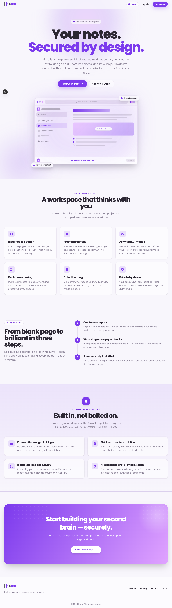 | 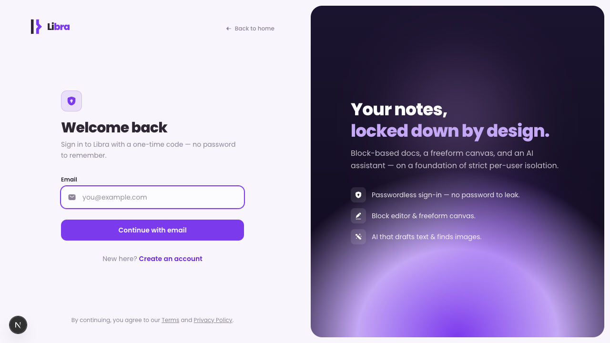 | 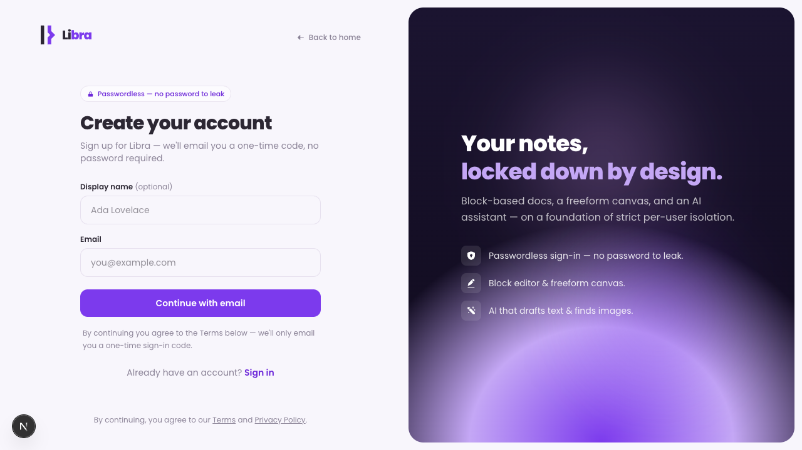 |

| Block editor | Freeform canvas | AI assistant |
|---|---|---|
| 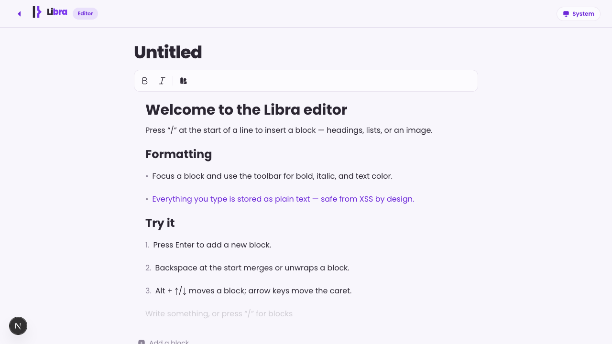 | 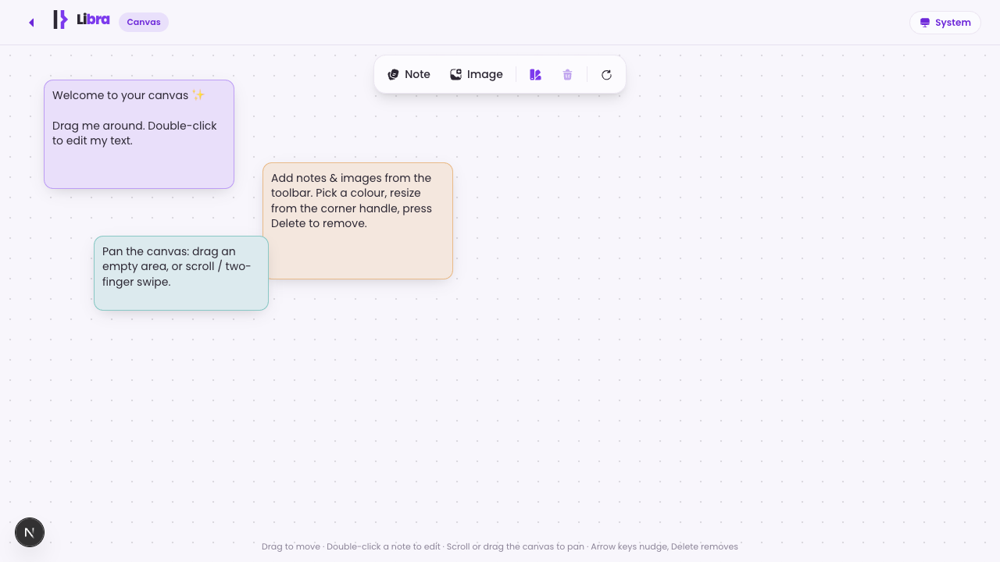 | 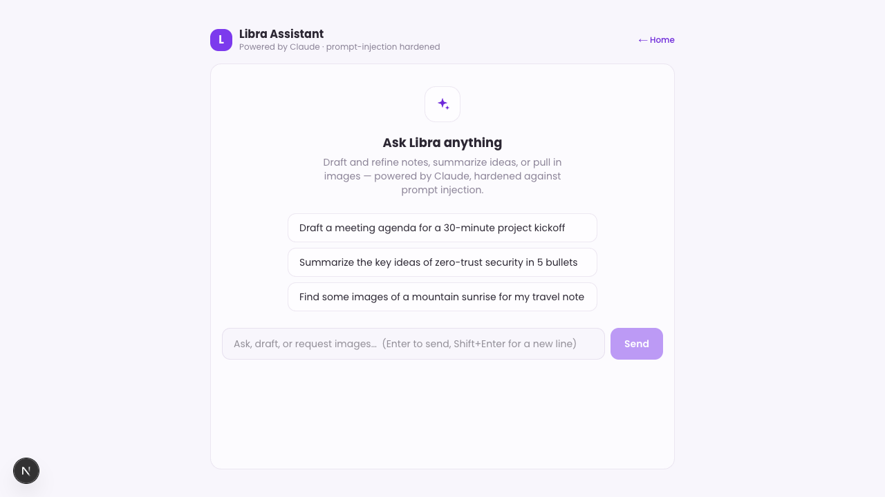 |

| Insert toolbar | Icon picker | Icon on the page |
|---|---|---|
| 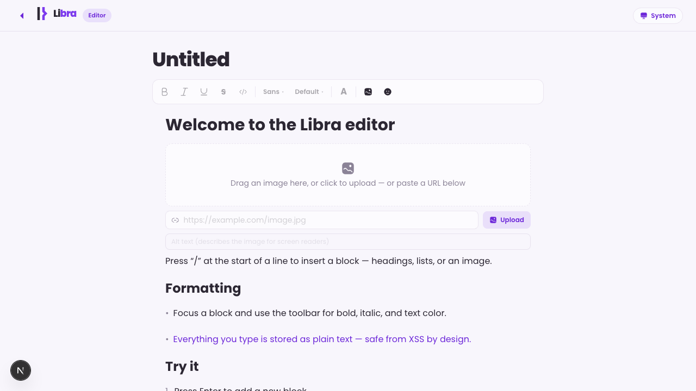 | 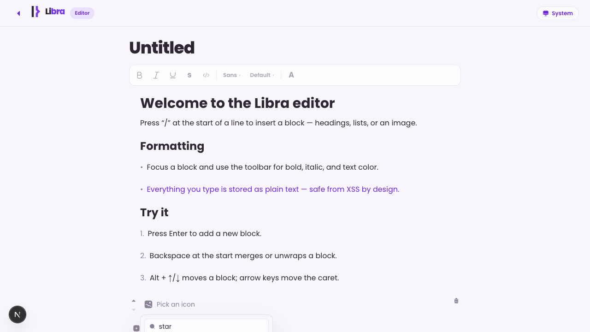 | 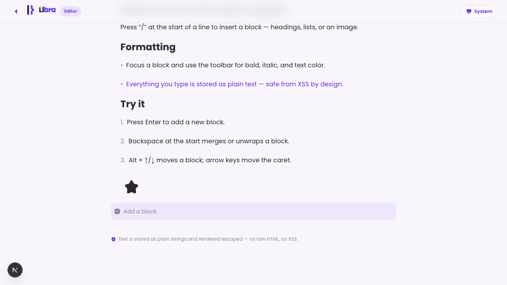 |

### Supabase backend (Row Level Security)

| Tables (`profiles`, `documents`) | RLS policies | Auth users |
|---|---|---|
| 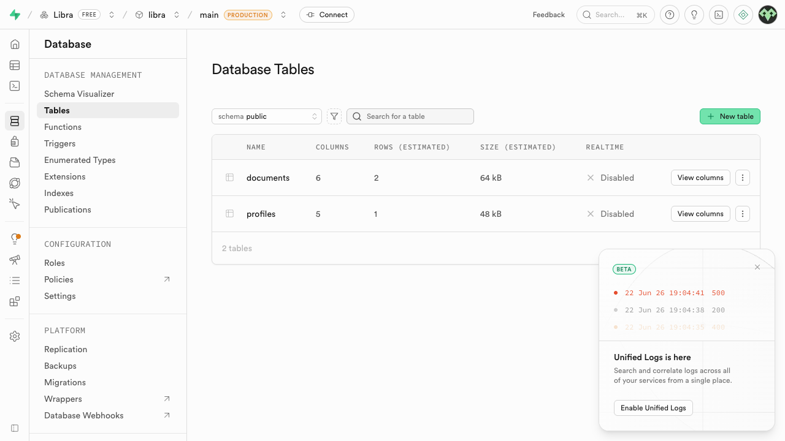 | 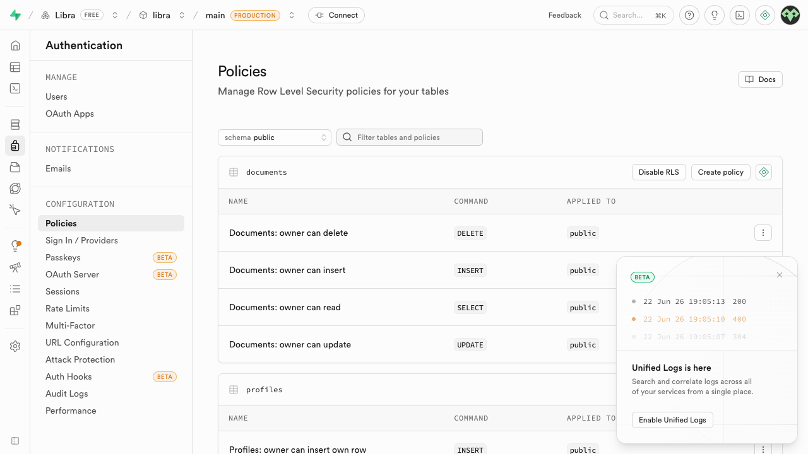 | 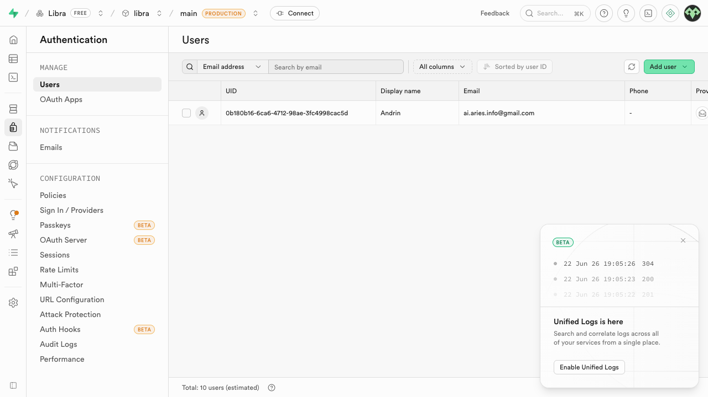 |

> Secrets live only in a local `.env.local` (gitignored). These screenshots document the live backend without exposing any keys.

### Security test evidence (animated)

Live recordings of the two structural controls (full matrix in [`docs/SECURITY-TESTS.md`](docs/SECURITY-TESTS.md)):

| T01 · A01 — RLS isolation | T02 · A05 — XSS rendered as inert text |
|---|---|
| 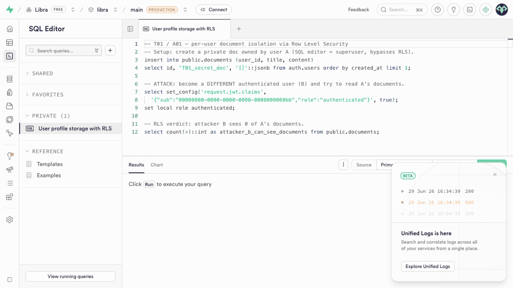 | 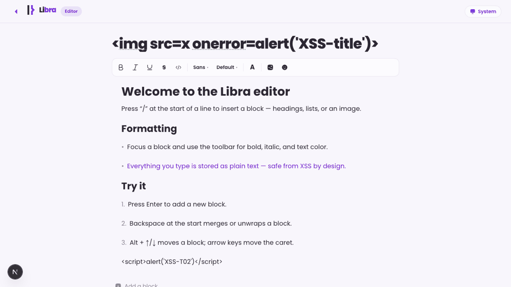 |

## Tech stack

- **Next.js 16** (App Router, `/src` directory)
- **React 19 + TypeScript** (strict mode)
- **Tailwind CSS v4** — design tokens defined as CSS variables in an `@theme` block (no `tailwind.config.js` theme)
- **Poppins** via `next/font/google` (weights 300–800)
- **[@solar-icons/react](https://www.npmjs.com/package/@solar-icons/react)** (Solar icon set, `Bold` weight) — the same icon language as the sibling **AriesAI** project
- No component library, no animation library — all animations are hand-rolled CSS keyframes.

## Getting started

### Run it locally (for reviewers / the teacher) 👀

Libra talks to a **hosted** Supabase backend (Postgres + Auth + Storage), so you
**don't** need to install or configure a database. You only need **two** values
from the author — the Supabase URL and its **publishable (anon) key** (both are
safe to share: the anon key is shipped to the browser and every request is still
constrained by Row Level Security). The author sends these to you; `.env.local`
itself stays gitignored.

**Prerequisites:** [Node.js](https://nodejs.org) 20 or newer, and `npm`.

**1. Clone and install**

```bash
git clone https://github.com/AriesDevIo/LibraAI.git
cd LibraAI
npm install
```

**2. Create your env file** from the template, then paste in the values the
author gave you:

```bash
cp .env.example .env.local
```

`.env.local` (already gitignored — never commit it):

```bash
# Keep this EXACTLY as-is: port 3000 is what Supabase allow-lists for the login redirect.
NEXT_PUBLIC_SITE_URL=http://localhost:3000

# Supabase — the only two values you actually need (provided by the author).
NEXT_PUBLIC_SUPABASE_URL=https://<project>.supabase.co
NEXT_PUBLIC_SUPABASE_ANON_KEY=<provided by the author>

# Optional — leave BLANK; not required to run or test the app:
#  • SUPABASE_SERVICE_ROLE_KEY is never read at runtime (it only sits on the
#    denylist that the AI subprocess strips), so it doesn't need a value.
#  • ANTHROPIC_API_KEY isn't used either — the AI authenticates via the Claude
#    Max subscription, not this key (see the AI note below).
SUPABASE_SERVICE_ROLE_KEY=
ANTHROPIC_API_KEY=
```

**3. Start the app**

```bash
npm run dev      # → http://localhost:3000
```

**4. Sign in.** Open <http://localhost:3000>, choose **Create an account** (or
**Log in**), enter your email, then **click the magic link** in your inbox.

> ℹ️ On Supabase's free tier the email contains a **magic link only** — the
> 6-digit code box won't be auto-filled, so just click the link. You then land in
> **your own private account**; your notes are isolated from every other user —
> that's the A01 access-control guarantee in action.

**5. Test the security matrix.** Reproduce the OWASP **T01–T05** tests using
[`docs/SECURITY-TESTS.md`](docs/SECURITY-TESTS.md) and the walk-through in
[`docs/DEMO.md`](docs/DEMO.md).

> ⚠️ **AI assistant — one extra requirement.** Everything above (block editor,
> canvas, login, document persistence, image upload, and all five security tests)
> works with just the env values. The **AI assistant is the one exception:** it
> runs through the Claude Agent SDK on the developer's **Claude Max
> subscription** (it spawns the Claude Code subprocess, so it's **dev-only** and
> not on a hosted deploy). To use it on your machine you must have Claude
> credentials present — either be **logged into Claude Code locally**, or add a
> `CLAUDE_CODE_OAUTH_TOKEN` (from `claude setup-token`, signed in to a Max
> account) to `.env.local`. Without that, the app still runs — only AI replies
> error. See [Not implemented](#not-implemented-honest-scope).

### Scripts

```bash
npm install      # install dependencies
npm run dev      # start the dev server → http://localhost:3000
npm run build    # production build (type-check + lint + bundle)
npm run lint     # ESLint
npm start        # serve the production build
```

## Project structure

```
src/
├─ app/
│  ├─ layout.tsx        # root layout: Poppins font, metadata, pre-paint theme script
│  ├─ page.tsx          # home route — landing sections
│  ├─ globals.css       # design system: @theme tokens, light/dark, libra- keyframes
│  ├─ (auth)/           # login & register pages + passwordless server actions + shared layout
│  ├─ auth/callback/    # magic-link callback (code → session)
│  ├─ dashboard/        # authenticated app shell (sidebar):
│  │   ├─ layout.tsx     #   gates auth + wraps every page in the shell
│  │   ├─ page.tsx       #   Home — AI prompt that drafts/creates documents (+ HomePrompt, DocumentsSection)
│  │   ├─ docs/          #   full document list
│  │   ├─ doc/[id]/      #   document workspace: Editor + Canvas views + AI panel (autosave)
│  │   ├─ assistant/     #   standalone AI assistant
│  │   ├─ settings/      #   profile · appearance (theme) · account · danger zone
│  │   └─ actions.ts     #   document mutations (Server Actions, RLS-scoped)
│  ├─ editor/ · canvas/ · assistant/   # public standalone demos (no auth)
│  └─ api/ai/chat/       # AI chat route (Claude) — auth-gated + per-user rate-limited
├─ components/
│  ├─ shared/           # Logo, ThemeToggle, PillLink, SectionHeading
│  ├─ shell/            # AppShell, Sidebar, SidebarContent, MobileNav, nav
│  ├─ marketing/        # Navbar, Hero, Features, HowItWorks, Security, CTABanner, Footer
│  ├─ editor/           # BlockEditor, Block, SlashMenu, Toolbar, IconPicker, icons, types
│  ├─ canvas/           # Canvas + objects (text / image / icon) + toolbar
│  └─ ai/               # AssistantPanel, markdown renderer
├─ lib/
│  ├─ supabase/         # browser + server clients (RLS-enforced)
│  ├─ documents.ts      # RLS-scoped document reads
│  ├─ uploads.ts        # image upload to Supabase Storage (type + size guards, no SVG)
│  ├─ ai/               # system prompt (injection-hardened), config, rate limit
│  └─ sanitize.ts       # text / URL sanitisation helpers
├─ hooks/useTheme.ts    # 3-mode theme controller (system → light → dark), SSR-safe
├─ types/theme.ts       # ThemeMode union + cycle order
└─ proxy.ts             # session refresh + route protection (Next renames middleware → proxy)

supabase/migrations/    # 0001_profiles · 0002_documents · 0003_canvas · 0004_storage (tables, RLS, Storage)
docs/                   # SECURITY-TESTS.md (pentest protocol), DEMO.md, screenshots/, security-tests/ (GIFs)
```

### Brand logo

The brand mark is an inline, background-less SVG baked into the [`Logo`](src/components/shared/Logo.tsx) component — nothing to drop in, nothing to 404. It uses CSS-variable fills so it adapts to light/dark automatically, in a two-tone treatment (the stem in theme ink, the arrow in brand violet). A standalone copy lives at [`public/libra-mark.svg`](public/libra-mark.svg) for reuse (decks, docs), and [`src/app/icon.svg`](src/app/icon.svg) is the matching browser-tab favicon. Pass `variant="violet" | "twotone" | "lavender"` to `Logo` to switch treatments.

## Design system

Design tokens (`--color-bg`, `--color-fg`, `--color-primary`, `--color-secondary`, etc.) live as CSS variables in [`src/app/globals.css`](src/app/globals.css). Light mode is the default; dark mode is applied two ways:

- automatically via `@media (prefers-color-scheme: dark)`, and
- explicitly via a `data-theme="dark" | "light"` attribute on `<html>` (set by the navbar theme toggle and persisted to `localStorage`).

The `@theme inline` block registers these variables as Tailwind tokens, so utilities reference the live `var()` and the whole UI switches themes automatically. Components reference tokens only — no hardcoded hex.

---

## Security (OWASP Top 10 2025)

Security is the graded focus of this project. Implemented and tested:

- **A01 Broken Access Control** — Row Level Security on every table; owner-only policies (`auth.uid() = id/user_id`), deliberately **no** permissive `using(true)`. Storage writes are scoped to a per-user folder. `proxy.ts` redirects unauthenticated users away from protected routes, and the AI route returns `401` without a session.
- **A02 Security Misconfiguration** — secrets only in gitignored `.env.local`; security headers (HSTS, X-Frame-Options, CSP); DB functions pin `search_path = ''`; the auth callback validates `next` to a same-site path (no open redirect).
- **A05 Injection** — editor **and** canvas never render untrusted input as HTML (no `dangerouslySetInnerHTML` on user content); all formatting is a closed-set whitelist (keys, never raw CSS/markup); image URLs validated to `http(s)`; uploads restricted to raster types (**no SVG**) + size cap; stored canvas objects re-sanitised on load; the AI system prompt is hardened against prompt injection with **every built-in tool disabled** and secrets stripped from its environment.
- **A07 Authentication Failures** — passwordless login (no password to leak); no user-enumeration on login; server-side rate-limiting surfaces a friendly HTTP 429 message.
- **A09 Logging & Alerting** — Supabase logs capture auth/RLS events with timestamps (verified populated + queryable).

The **T01–T05 pentest matrix** is documented in [`docs/SECURITY-TESTS.md`](docs/SECURITY-TESTS.md) (all five PASS; T01 RLS and T02 XSS include [animated evidence](docs/security-tests/)). A demo walk-through is in [`docs/DEMO.md`](docs/DEMO.md); the work log + 24-hour plan in [`ARBEITSJOURNAL.md`](ARBEITSJOURNAL.md).

## Roadmap

### ✅ Step 1 — Foundation & landing page (done)
- Next.js + TypeScript + Tailwind v4 scaffold
- Full purple design system: CSS-variable tokens, light/dark mode, `libra-` keyframe animations, Poppins
- Polished marketing landing page: Navbar, Hero (with floating mockup), Features, How It Works, Security, CTA banner, Footer
- Theme toggle with persistence; mobile-responsive and accessible

### ✅ Step 2 — Authentication & secure backend (done)
- Passwordless email login & registration (magic-link / OTP) via Supabase Auth — `/login`, `/register`
- Supabase Postgres with **Row Level Security**: `profiles` + `documents` tables, owner-only policies
- Session handling & route protection in `proxy.ts`; a profile row is auto-created on sign-up (DB trigger)
- Minimal authenticated `/dashboard` landing

### ✅ Step 3 — Block editor (done)
- Notion-style block editor — headings, paragraphs, lists, to-dos, quote / callout / code / divider blocks, an image block and an emoji **icon** block
- Text formatting: bold / italic / underline / strikethrough / inline-code, **font family + size**, and brand-palette text colour — all stored as closed-set keys (never raw markup)
- Slash menu + XSS-safe rendering (no raw HTML for user content)

### ✅ Step 4 — Persistence, canvas & AI (done)
- Documents persist per user (editor + dashboard ↔ Supabase, RLS) — `/dashboard`, `/dashboard/doc/[id]`
- Freeform canvas with draggable text / image / emoji objects, resize, recolour, duplicate, reorder, pan
- AI assistant (Claude) for text generation + image fetch, hardened against prompt injection

### ✅ Step 5 — Unified workspace, settings & uploads (done)
- **App shell** with a persistent sidebar (Home · Documents · Settings) + mobile drawer
- A **document is one workspace**: switch between the **Editor** and **Canvas** views and toggle an **AI assistant** panel — the canvas is saved on the document (no more orphan boards)
- **Settings**: profile (display name), appearance (light / dark / system), account, danger zone
- **Image upload** to Supabase Storage (per-user folder, raster-only, size-capped) in the editor and canvas
- AI can **draft and create documents** for you and **insert blocks** into the open note; replies render as Markdown

### ✅ Step 6 — Penetration testing & documentation (done)
- OWASP test matrix **T01–T05** executed and documented in [`docs/SECURITY-TESTS.md`](docs/SECURITY-TESTS.md) (all PASS)
- Animated evidence for **T01 (RLS)** and **T02 (XSS)** in [`docs/security-tests/`](docs/security-tests/)
- Demo walk-through in [`docs/DEMO.md`](docs/DEMO.md)

## Not implemented (honest scope)

In the interest of an accurate record, these items from the original concept were **not built**:

- **Document sharing between users.** This was planned, but with the time available it was not completed. It was a deliberate trade-off: a sharing feature means a new `shares` table with cross-user Row-Level-Security policies, and a half-finished version risks exactly the kind of broken-access-control hole this project is graded on. We chose to ship a smaller surface that is **fully secured and tested** rather than a larger one that isn't.
- **Image _editing_** (cropping, filters). Images can be **embedded by URL and uploaded**, but there is no in-app editing — the original scope mentioned an "image editor."
- The AI assistant runs against a Claude **subscription locally (dev)**, not a hosted API key, so it isn't available on a static deployment.

## Arbeitsjournal

A dated work log (planning, weekly progress, hours, and OWASP measures) lives in [`ARBEITSJOURNAL.md`](ARBEITSJOURNAL.md).

---

_Built as a security-focused school project._
